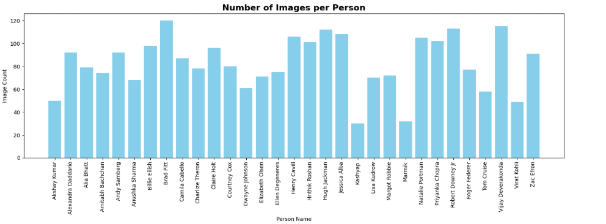
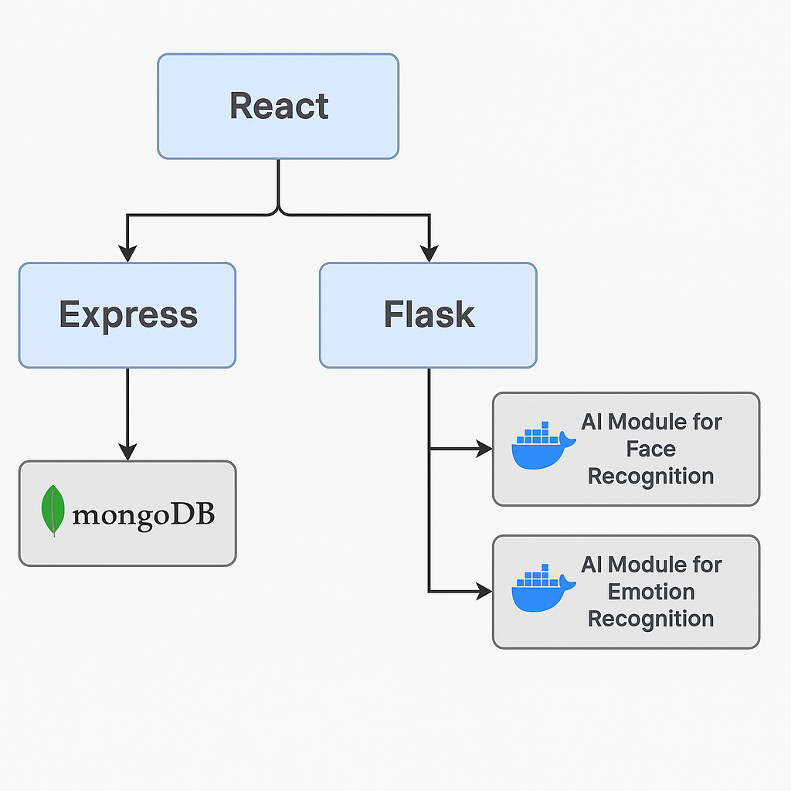
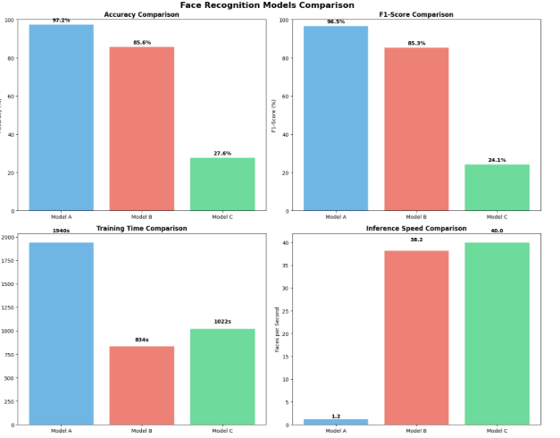
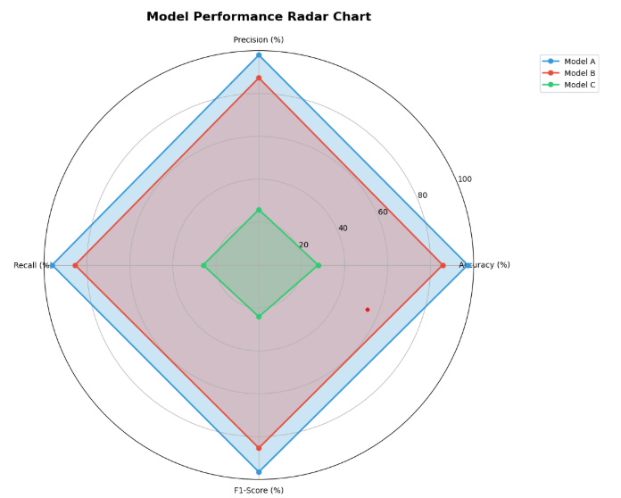
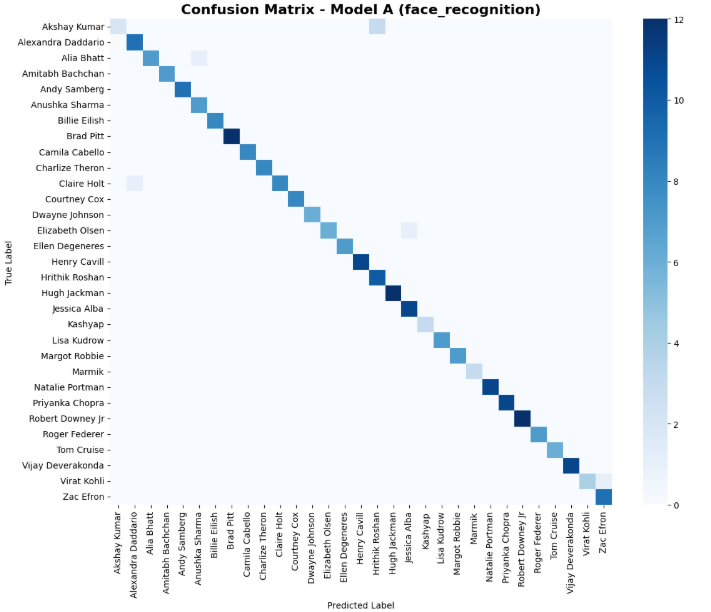
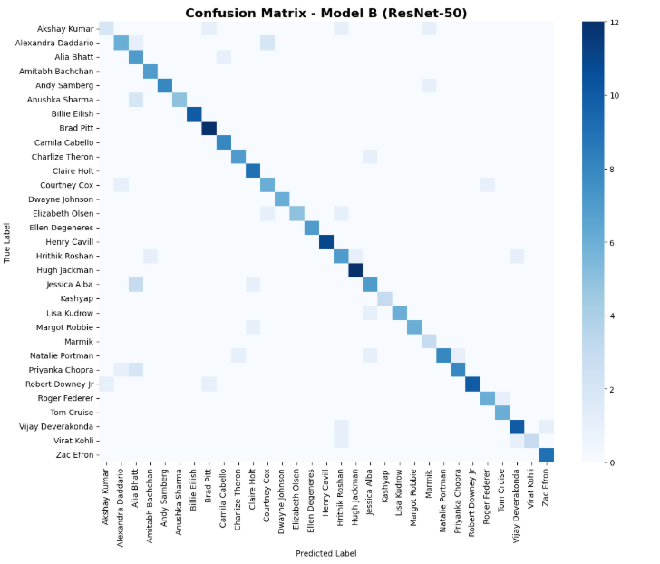
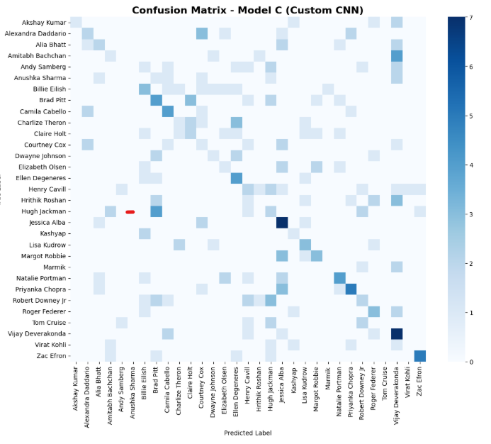

# Sistem za preverjanje prisotnosti s prepoznavo obraza

## Povzetek

Razvit je bil sistem za avtomatizirano preverjanje prisotnosti, ki temelji na prepoznavi obrazov v realnem času. Sistem omogoča zaznavanje in identifikacijo oseb preko kamere ter samodejno beleženje njihove prisotnosti v podatkovno bazo. Uporabnikom je na voljo spletni nadzorni vmesnik za upravljanje dogodkov in pregled zabeleženih prisotnosti.

Poleg osnovne funkcionalnosti sistem vključuje tudi modul za prepoznavo čustev, ki omogoča zaznavanje čustvenega stanja udeležencev in s tem dodaja kontekstualno vrednost zbranim podatkom. Za oceno učinkovitosti sistema je bila izvedena primerjalna analiza treh pristopov k prepoznavanju obrazov: privzetega modela iz knjižnice `face_recognition`, modela ResNet-50 z uporabo prenosa znanja ter lastnega modela, razvitega z uporabo konvolucijske nevronske mreže (CNN). Primerjava se je osredotočila na natančnost, hitrost učenja in sklepanja ter velikost posameznih modelov.

Rezultati analize so omogočili informirano izbiro najustreznejšega modela za praktično uporabo. Sistem deluje zanesljivo in učinkovito ter je primeren za širok nabor scenarijev sledenja prisotnosti.

## Uvod

V današnjem digitalno preoblikovanem svetu postaja avtomatizacija vsakdanjih nalog vse pomembnejša za učinkovito upravljanje virov, časa in človeškega dela. Eden od procesov, ki se še vedno pogosto izvaja ročno, je spremljanje prisotnosti na dogodkih, predavanjih ali v delovnih okoljih. Tradicionalne metode – kot so podpisovanje na papir, uporaba identifikacijskih kartic ali prijava prek terminalov – so neučinkovite, nagnjene k napakam in zlahka zlorabljive. Poleg tega ne omogočajo sprotnega vpogleda v podatke ter pogosto zahtevajo dodatno obdelavo za analitiko in poročanje.

Za reševanje teh izzivov smo razvili inteligentni sistem za preverjanje prisotnosti, ki temelji na računalniškem vidu in analizi obrazov v realnem času. Ključna prednost sistema je popolna avtomatizacija: posamezniki so zaznani in identificirani s pomočjo kamere, njihova prisotnost pa se nemudoma in samodejno zabeleži v podatkovno bazo. Tako se odpravi potreba po posredovanju osebja, poveča se natančnost ter omogoči hitrejši odziv v primeru napak ali nepravilnosti.

Še pred začetkom razvoja celotnega sistema smo izvedli obsežno **analizo učinkovitosti treh različnih modelov za prepoznavo obrazov**, da bi izbrali najprimernejšega za uporabo v praksi:

- **Model A** temelji na knjižnici `face_recognition`, ki uporablja dlib in CNN-enkoder za obraze.
- **Model B** je globoka nevronska mreža **ResNet-50** s prenosom znanja.
- **Model C** pa je **lastno razvit konvolucijski model (CNN)**, zasnovan iz nič za večji nadzor in učinkovitost.

Vse modele smo preizkusili na istem naboru obrazov in jih ovrednotili glede na **natančnost, čas učenja, hitrost sklepanja in porabo pomnilnika**. Na podlagi rezultatov smo izbrali najbolje delujoči model, ki smo ga nato integrirali v končni sistem za preverjanje prisotnosti.

Sistem je bil razvit tako, da je:

- **Zanesljiv** – omogoča natančno identifikacijo tudi v dinamičnih okoljih.
- **Prilagodljiv** – primeren za različne scenarije, kot so šole, podjetja, konference in varnostni sistemi.
- **Razširljiv** – omogoča enostavno dodajanje dodatnih funkcionalnosti, kot so analiza čustev in beleženje metapodatkov.
- **Uporabniku prijazen** – z intuitivno spletno nadzorno ploščo za upravljanje dogodkov, prisotnosti in izvoza podatkov.

Ključne komponente sistema vključujejo:

- **Spletno nadzorno ploščo** za ustvarjanje in upravljanje dogodkov, uporabnikov ter pregled zgodovine prisotnosti.
- **Strežniški API-sloj**, ki omogoča varno komunikacijo med komponentami in zanesljivo obdelavo podatkov.
- **Bazo podatkov**, kjer se shranjujejo uporabniški profili, dogodki, prisotnosti in spremljajoči metapodatki.
- **Modul za zaznavanje obrazov**, ki s pomočjo kamere deluje v realnem času in primerja zaznane obraze z obstoječimi profili.

Pomembna nadgradnja sistema je tudi **modul za prepoznavo čustev**, ki omogoča analizo obraznih izrazov in s tem dodaja dodatni kontekst zbranim podatkom. Ta funkcionalnost se lahko izkaže za posebej uporabno pri spremljanju zadovoljstva, razpoloženja zaposlenih ali v psihološko usmerjenih analizah.

S tem projektom smo želeli pokazati, da je mogoče sodobne metode umetne inteligence povezati v enotno, uporabniku prijazno in učinkovito rešitev, ki ponuja realne prednosti v praksi in odpira pot nadaljnji nadgradnji, kot so sledenje vedenjskim vzorcem, napredna analitika in optimizacija delovnih procesov.

### Kako zagnati sistem

Projekt je bil razvit kot praktičen, funkcionalen sistem, ki omogoča sledenje prisotnosti z uporabo kamere, prepoznavo obrazov in upravljanje dogodkov preko spletnega vmesnika. Arhitektura je sestavljena iz več povezanih komponent: React (frontend), Express.js (backend + MongoDB), Flask (most) in AI modul za zaznavo obrazov (dockeriziran Python modul). Za zagon celotnega sistema so na voljo pripravljene skripte, ki se nahajajo v mapi `scripts/`.

#### ✅ Prva namestitev (potrebno samo enkrat)

1. Nastavite virtualna okolja za backend (Express in Flask):

```bash
./scripts/setup_venvs.sh
```

2. Izgradite Docker sliko, ki vključuje podatkovno bazo in AI modul za prepoznavo obrazov:

```bash
./scripts/docker_build.sh
```

#### ▶️ Zagon sistema (ob vsakem zagonu)

Ko je okolje pripravljeno, je za delovanje sistema potrebno zagnati naslednje komponente:

1. Flask strežnik, ki deluje kot most med frontendom in AI modulom:

```bash
./scripts/run_flask.sh
```

2. Express.js strežnik, ki upravlja z MongoDB bazo uporabnikov in dogodkov:

```bash
./scripts/run_express.sh
```

3. Docker kontejner, ki vsebuje AI modul za zaznavo obrazov in prepoznavo oseb:

```bash
./scripts/docker_run.sh
```

#### 🌐 Zagon spletnega vmesnika

V mapi `Dashboard/` zaženite React aplikacijo:

```bash
npm run start
```

#### 📌 Uporaba

Po uspešnem zagonu vseh komponent je sistem dostopen preko spletnega brskalnika. Uporabnik lahko:

- ustvarja in upravlja dogodke,
- dodaja nove uporabnike z njihovimi slikami,
- spremlja prisotnost v realnem času,
- pregleduje zgodovino prisotnosti in izvozi podatke po potrebi.

Model za prepoznavo obrazov je nameščen in zagnan znotraj Docker okolja. Vključuje vse slike oseb, ki se nahajajo v mapi `AI/training_images/`, in jih obdeluje s pomočjo knjižnice `face_recognition`. Sistem temelji na prej izvedeni analizi učinkovitosti različnih modelov (glej poglavje _Poskusi in rezultati_) in je zasnovan tako, da se ob zagonu samodejno naloži najbolj optimalni model.

Če želite dodati novo osebo za prepoznavo, preprosto dodajte njeno sliko v mapo `AI/training_images/` (z ustreznim imenom, npr. `Janez.jpg`) in zaženite naslednjo skripto:

```bash
python training_script.py
```

S tem se bo samodejno posodobila datoteka `known_faces.pkl`, ki jo AI modul uporablja za prepoznavo obrazov.

## Metodologija

Razvoj sistema je potekal v dveh fazah. V prvi fazi smo izvedli testiranje različnih pristopov za prepoznavo obrazov, v drugi pa integracijo najbolje delujočega modela v sistem za preverjanje prisotnosti.

#### 📌 Faza 1: Primerjava modelov za prepoznavo obrazov

Uporabili smo javno dostopen podatkovni nabor s portala Kaggle:  
🔗 **[Face Recognition Dataset – vasukipatel](https://www.kaggle.com/datasets/vasukipatel/face-recognition-dataset)**

📊 **Povzetek nabora podatkov**:

- Skupno število slik: **2.562**
- Skupno število oseb: **31**
- Povprečno število slik na osebo: **82.65**
- Najmanj slik na osebo: **30**
- Največ slik na osebo: **120**

Na spodnji sliki je prikazano število slik na posamezno osebo znotraj nabora:



Podatkovni nabor smo razdelili v razmerju 70:15:15 (učenje:validacija:test). Na podlagi tega smo primerjali naslednje tri modele:

Podatkovni nabor smo razdelili v razmerju 70:15:15 (učenje:validacija:test). Na podlagi tega smo primerjali naslednje tri modele:

#### Model A – `face_recognition` (dlib-based CNN)

- Uporablja knjižnico `face_recognition`, ki temelji na `dlib` in CNN za generacijo 128-dimenzionalnih vektorskih predstavitev obrazov.
- Obrazi so kodirani s funkcijo `face_encodings()` in primerjani z že znanimi predstavitvami z `compare_faces()` in `face_distance()`.
- Model ne zahteva dodatnega treniranja, saj deluje po principu primerjave z že shranjenimi kodami znanih obrazov.

#### Model B – ResNet-50 z uporabo prenosa učenja

- Uporabljena je bila predtrenirana arhitektura `ResNet-50` iz `torchvision.models`.
- Zadnji **klasifikacijski sloj `fc` (Fully Connected)** je bil zamenjan z novim `Linear` slojem z izhodom v velikosti števila razredov (31).
- Treniranje je bilo izvedeno s `Adam` optimizerjem, `CrossEntropyLoss` funkcijo izgube in `StepLR` schedulerjem.
- Vhodne slike so bile obdelane z `RandomResizedCrop`, `HorizontalFlip`, `ColorJitter` in `Normalize`.

#### Model C – Lastna CNN arhitektura

- Model je bil ročno definiran s pomočjo `torch.nn.Module`.
- Arhitektura sledi tipični strukturi CNN z zaporednimi bloki:
  - **Blok 1:** `Conv2d → BatchNorm2d → ReLU → MaxPool2d`
  - **Blok 2:** `Conv2d → BatchNorm2d → ReLU → MaxPool2d`
  - **Blok 3:** `Conv2d → BatchNorm2d → ReLU → MaxPool2d`
  - Nato sledi **Flatten** in zaključni klasifikacijski del:
  - `Dropout → Linear → ReLU → Dropout → Linear (izhod = 31)`
- Uporabljen je bil `SGD` optimizer, `CrossEntropyLoss` in `MultiStepLR` scheduler.
- Slike so bile predhodno obdelane z `Resize`, `RandomHorizontalFlip`, `RandomRotation`, `ColorJitter` in `Normalize`.

#### 📊 Metodologija vrednotenja

Za primerjavo modelov smo uporabili naslednje metrike:

- **Accuracy (%):** razmerje pravilno klasificiranih primerov
- **Precision (%):** TP / (TP + FP)
- **Recall (%):** TP / (TP + FN)
- **F1-Score (%):** 2 _ (precision _ recall) / (precision + recall)
- **Training Time (s):** čas potreb za treniranje modela
- **Inference Speed (faces/s):** število prepoznanih obrazov na sekundo
- **Model Size (MB):** velikost modela na disku

Vrednosti metrik so bile izračunane na testnem delu podatkovnega nabora. Rezultati so bili prikazani v tabelah in grafih (stolpčni diagrami, radar graf).

### 📦 Faza 2: Integracija sistema

Na podlagi rezultatov testiranja iz faze 1 smo v sistem integrirali model A — knjižnico `face_recognition`, saj je pokazala najboljše razmerje med hitrostjo in natančnostjo (glej poglavje _Poskusi in rezultati_). Sistem smo zasnovali kot razširljiv in modularen, pri čemer je vsak del aplikacije odgovoren za točno določeno nalogo.

#### 🧩 Pregled arhitekture sistema

Celoten sistem je sestavljen iz naslednjih komponent:

**1. 📷 Kamera + AI modul (Docker)**  
Modul za prepoznavo obrazov je implementiran v jeziku Python z uporabo knjižnice `face_recognition`. Kamera prek modula `camera_client.py` zajema slike in jih pošilja v zaledni API `/recognize`, ki vrne seznam prepoznanih oseb.  
Modul deluje znotraj Docker okolja in uporablja `known_faces.pkl` za vnaprej naučene vektorske predstavitve uporabnikov.

**2. 🧠 Prepoznavanje čustev**  
Vzpostavljen je ločen Flask strežnik (na portu 5002), ki uporablja knjižnico `deepface` za zaznavo obraznih čustev. Vhodna slika je kodirana v base64 in poslana na `/analyse`, kjer se izvede analiza čustev z uporabo modela RetinaFace.

**3. 🎥 AI kontrolni most (Flask bridge)**  
Komponenta `AI_Control/app.py` deluje kot vmesnik med uporabniškim vmesnikom (frontend) in AI modulom. Omogoča zagon in zaustavitev modula za prepoznavo prek HTTP zahtevkov na `/start-camera` in `/stop-camera`.

**4. 🌐 Express.js strežnik**  
Glavni strežnik zaledja je implementiran v Express.js in zagotavlja REST API za delo z dogodki, uporabniki in prisotnostjo.  
Moduli vključujejo:

- `routes/attendanceRoutes.js`: beleži prisotnost glede na ID uporabnika ali prepoznano ime.
- `routes/eventRoutes.js`: ustvarjanje, brisanje in upravljanje dogodkov.
- `routes/userRoutes.js`: dodajanje novih uporabnikov z možnostjo nalaganja slike (Multer).
- Podatki se hranijo v MongoDB prek modelov `User`, `Event` in `Attendance`.

**5. 💻 React frontend (Dashboard)**  
Uporabniški vmesnik omogoča organizatorjem dogodkov:

- ustvarjanje novih dogodkov,
- zagon kamere z dodeljenim dogodkom,
- pregled udeležencev in njihove prisotnosti v realnem času,
- izvoz in brisanje dogodkov po potrebi.

Glavne funkcionalnosti vključujejo:

- Komunikacijo s strežniki na `localhost:5000`, `localhost:4000` in `localhost:5001`.
- Vmesnik za zagon AI kamere in zaustavitev.
- Vizualizacijo prisotnosti s pomočjo material-ui komponent.

#### 🖼️ Diagram arhitekture sistema

Spodnji diagram prikazuje medsebojne povezave med komponentami sistema:



## 📊 Rezultati

Po izvedbi faze testiranja smo primerjali tri modele glede na različne metrike, pri čemer smo uporabili skupno 2562 slik iz javno dostopnega nabora podatkov z 31 različnimi osebami. Ocena je bila izvedena na testnem delu podatkovnega nabora.

Uporabljene metrike:

- **Accuracy (%):** Delež pravilno prepoznanih primerov.
- **Precision (%):** Natančnost klasifikacije (TP / (TP + FP)).
- **Recall (%):** Občutljivost modela (TP / (TP + FN)).
- **F1-Score (%):** Harmonizirana sredina med precision in recall.
- **Training Time (s):** Čas treniranja modela v sekundah.
- **Inference Speed (faces/s):** Število obrazov, ki jih model obdeluje na sekundo.

### 📐 Kvantitativna primerjava modelov

| Model   | Accuracy (%) | Precision (%) | Recall (%) | F1-Score (%) | Training Time (s) | Inference Speed (faces/s) |
| ------- | ------------ | ------------- | ---------- | ------------ | ----------------- | ------------------------- |
| Model A | 97.24        | 97.94         | 96.20      | 96.49        | 1939.91           | 1.17                      |
| Model B | 85.60        | 87.29         | 85.53      | 85.33        | 834.45            | 38.16                     |
| Model C | 27.63        | 25.87         | 25.90      | 24.14        | 1021.56           | 39.97                     |

### 📈 Vizualna primerjava

#### 📊 Stolpčni in radar grafi

Na spodnji sliki so prikazani:

- Stolpčni diagrami za _accuracy_, _F1-score_, _čas treniranja_ in _hitrost sklepanja_
- Radar graf, ki prikazuje primerjavo štirih ključnih metrik



#### 🕸️ Radar graf – celostna zmogljivost modelov



### 🔎 Matrike zmede

Za vsakega izmed modelov smo generirali matriko zmede, ki prikazuje število pravilnih in nepravilnih klasifikacij po posameznih osebah.

- **Model A** – `face_recognition`:

  

- **Model B** – `ResNet-50`:

  

- **Model C** – Custom CNN:

  

---

Na podlagi prikazanih rezultatov je bil za produkcijsko integracijo izbran **Model A**, saj je dosegel najvišjo natančnost in F1-mero, kar je ključno za zanesljivo prepoznavo obrazov v realnem času.
