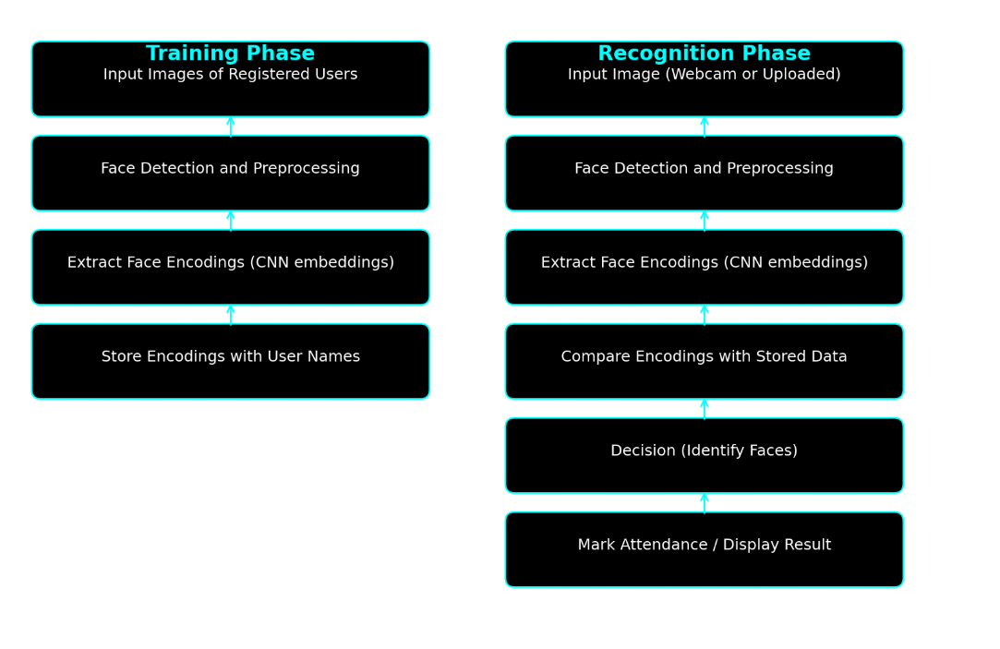

# Automated Attendance System Using Face Recognition

## Problem Definition

Manual attendance tracking (e.g., in lectures, meetings, or events) is inefficient, error-prone, and can be manipulated. This project aims to develop an automatic attendance system using computer vision and face recognition. The system identifies individuals through images and accurately records attendance.

### Keywords

- Face Recognition
- Automated Attendance
- Computer Vision
- Convolutional Neural Networks (CNN)
- Deep Learning

---

## Related Work

Face recognition technology has advanced significantly, with various algorithms available. The key research influencing this project includes:

- **FERET Evaluation Methodology** _(Phillips et al.)_: A standard approach to evaluating face recognition algorithms, focusing on accuracy and reliability using a large database of facial images.
- **Comparison of Dlib and OpenCV** _(Boyko et al.)_: Analysis of popular face recognition software (Dlib and OpenCV), highlighting their strengths, weaknesses, and suitability in real-world scenarios.
- **CNNs for Face Recognition** _(Kamencay et al.)_: Demonstrated how Convolutional Neural Networks (CNNs) improve accuracy and efficiency compared to traditional methods in recognizing faces.

These studies provide a solid foundation for choosing effective techniques and evaluating our face recognition system.

---

## Solution Plan

### Project Team

- **Group**: 1
- **Members**: Viktor Rackov, Mario Bojarovski, Marko Milenovic
- **GitHub Repository**: [FaceRecognition](https://github.com/bojarovski/FaceRecognition)
- **Development Environment**: Python

### Development Iterations

#### Iteration 1

- Data collection and analysis
- Set up development environment (Python, OpenCV, face_recognition)

#### Iteration 2

- Face encoding and storage
- Image capture from webcam and preprocessing

#### Iteration 3

- Face matching algorithm implementation
- Real-time performance optimization
- Command-line interface development

#### Iteration 4

- Graphical user interface (GUI) development
- Accuracy enhancement through parameter tuning
- System documentation and evaluation

---

## Solution Description (Workflow Diagram)

---

## Project Repository

[GitHub Project Repository](https://github.com/bojarovski/FaceRecognition)
